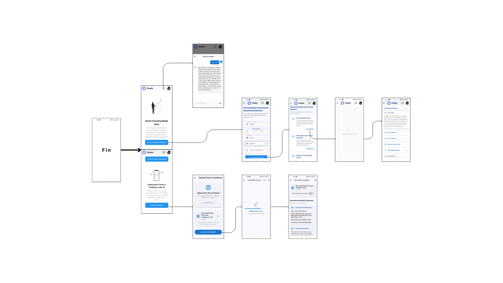

  

# Finaitic – Your AI-powered Financial Assistant

**Finaitic** is a GenAI-powered mobile app designed to simplify investment decisions and boost financial literacy. By combining artificial intelligence with modern financial data, Finaitic helps users understand complex terms, compare investment options, and make confident financial choices—all from their smartphones.

---

##  Problem Statement

In today's fast-paced world, making informed financial decisions is more crucial than ever. However, a large portion of individuals—especially **young adults** and **first-time investors**—face significant challenges when it comes to understanding and engaging with financial products.

### Key Problems:

- 📄 **Complex Financial Documents**  
  Investment brochures, insurance terms, and mutual fund documents are often filled with technical jargon and legal language that most people find difficult to understand.

- ❓ **Lack of Personalized Guidance**  
  Users often struggle with where to start, what to invest in, and how to align investments with their personal financial goals and risk tolerance.

- 🌐 **Overwhelming & Unreliable Information**  
  The internet is flooded with inconsistent or biased financial advice, making it hard for individuals to trust what they read or watch.

- 🌍 **Language and Accessibility Barriers**  
  Most financial tools are built for English-speaking audiences, leaving millions behind who are more comfortable in regional languages.

### Impact:

These challenges lead to:
- Poor or risky financial decisions  
- Missed investment opportunities  
- Fear or hesitation to invest at all
---

## How Finaitic Solves This

**Finaitic** is your personal AI-powered financial assistant that makes investing simple and stress-free.

It helps users by:

- 🧠 **Understanding You First**  
  Finaitic asks for your financial goals, how much risk you're comfortable with, and your budget—then gives smart, personalized investment suggestions.

- 📄 **Making Documents Easy to Read**  
  Got a confusing PDF or investment brochure? Just upload it or scan it. Finaitic reads and explains the complicated terms in simple language using GenAI.

- 💬 **Chat With AI for Instant Help**  
  Not sure what a financial term means? Want to ask something about your document? Use the built-in chat assistant to get instant answers—anytime.

- 🌐 **Speaking Your Language** *(Coming Soon)*  
  Finaitic will soon support 8 Indian languages, so more people can understand finance in the language they’re most comfortable with.

---

Finaitic solves real problems by making financial knowledge:
- Easy to understand  
- Personalized to your needs  
- Always available when you need help  

With Finaitic, you don’t need to be a finance expert to make smart decisions—you just need your phone.

---

## How It Works

1. **User Input**
Users provide basic details like financial goals, preferred investment types, and risk levels.

2. **AI Recommendation**
Gemini API analyzes the inputs and returns the top 3 tailored investment options with explanations.

3. **Document Upload/Scan**
Users can upload or scan financial documents. The app extracts key information using OCR and NLP.

4. **Simplified Output + Q&A**
The extracted content is summarized in simple language. Users can ask follow-up questions in real time.

5. **24/7 AI Assistant**
The assistant is always available in a draggable bottom sheet to help users navigate any financial decision.

---

## Tech Stack

| Layer          | Technologies Used                                              |
|----------------|---------------------------------------------------------------|
| **Frontend**   | Flutter                                                        |
| **Backend**    | Firebase (Auth, Storage, functions)* |
| **AI Engine**  | Gemini API (via `generateContent` endpoint)                   |
| **OCR**        | Google ML Kit *(Planned)*                                     |
| **Parsing**    | `pdf_text`, `tesseract_ocr`, `google_ml_kit`                  |
| **Languages**  | English + 8 Indian languages *(Coming Soon)*                  |

---
## App Wireframe

  

---
## Team

- Ninad  
- Mandar  
- Gauri  
- Tejas

---

> *"We're building a smarter, more inclusive financial future—one tap at a time."*

